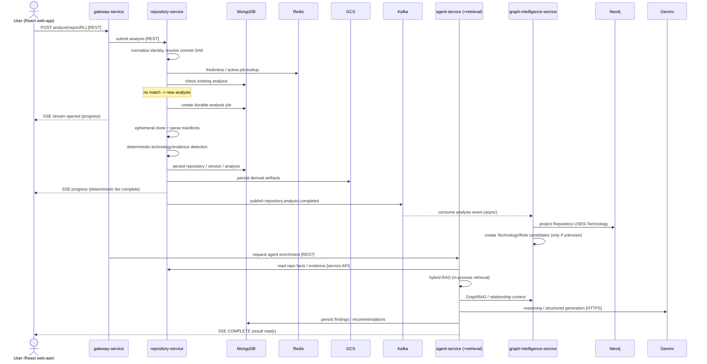
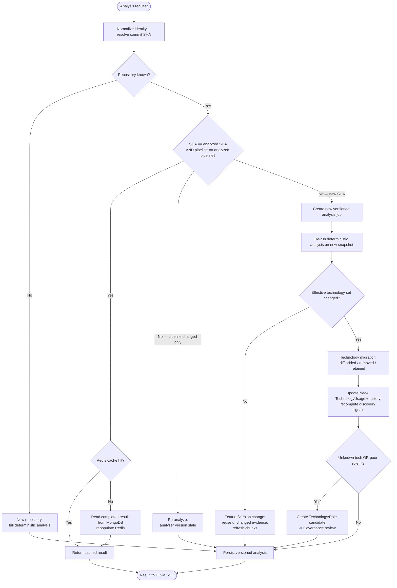
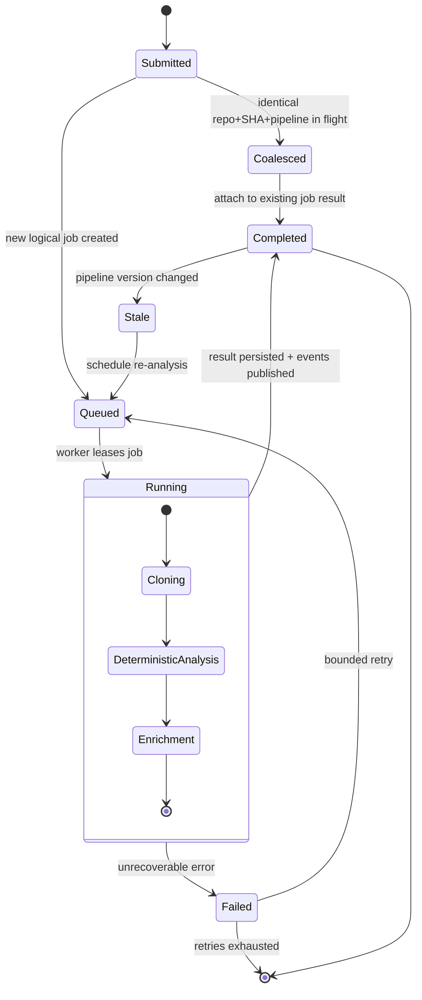
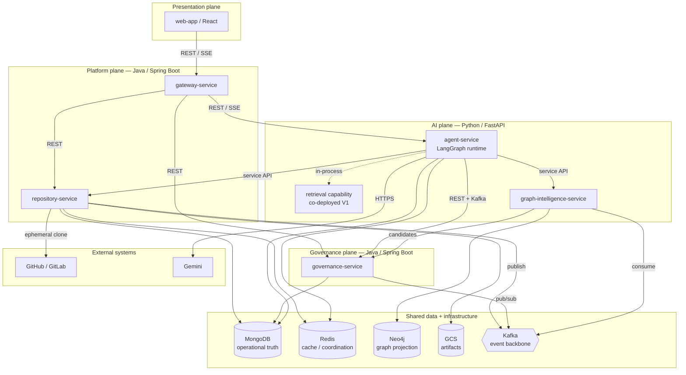

# StackSniffer — UML Diagram Set (Target Architecture)

> Scope: these diagrams model the **signed-off target microservices architecture**
> (HLD v2), not the current v0.1.0 baseline. GitHub renders Mermaid natively, so
> these blocks display inline in a repo README/wiki. `LATER` services
> (`model-service`/vLLM, Flink, Spark) are omitted to match V1 scope.

---

## 1. Sequence Diagram — New Repository Analysis (Scenario 1, §23.1)

The only path that exercises every service. Scenarios 2–4 are branch logic (see the
activity diagram).

Enforced invariants worth noting on the diagram in review: `agent-service` never reads
`repository-service` collections directly (service API only); Kafka is async and is not
the source of workflow truth; SSE carries progress while REST carries the command.

---

## 2. Activity Diagram — Analysis Request Routing (§23.2–23.5)

Encodes the freshness decision and the four scenarios in one flow. This is where the
"other three sequence scenarios" actually live.

---

## 3. State Diagram — Repository Analysis Job Lifecycle (§22.1)

Durable high-level job states. Duplicate-request coalescing and pipeline-staleness are
modeled explicitly because both are signed-off HLD behaviors, not implementation detail.

Note: `DEP_CLASSIFICATION_FAILED` (README known-limitation) is not a terminal state —
it is a low-confidence flag on a `Completed` result, so it is annotation on the job
record, not a state here.

---

## 4. Component Diagram — System / Service Level (§2, §22.1)

Services as components with their communication modes and data ownership. Per HLD §22.2,
per-service internal component/class diagrams are deferred to LLD and deliberately not
drawn here.

Ownership rule enforced by the layout: every service owns its own MongoDB collections;
no service uses another's collections as an integration contract (§16.1). Neo4j is a
rebuildable projection owned solely by `graph-intelligence-service`, not a second source
of truth.

---

## Deferred / out of scope

- **v0.1.0 baseline** versions of these diagrams (single backend, no Kafka/Neo4j) — say
  if you want them; the shape is very different.
- **Internal component diagrams** per service (e.g. inside `agent-service`) — LLD, §22.2.
- **LangGraph node/edge state diagram** — LLD, §22.2. The state diagram above is the
  *job* lifecycle, not the *agent workflow* graph.
- **LATER services** (vLLM `model-service`, Flink `stream-analytics`, Spark
  `offline-analytics`) — excluded to keep the diagrams at V1 scope.

Part A — HLD UML Set

A1. Sequence — New Repository: Deterministic Analysis + Automatic AI Classification

sequenceDiagram
    actor U as User
    participant GW as gateway-service
    participant RS as repository-service
    participant DB as Mongo/Redis
    participant K as Kafka
    participant AG as agent-service (Classification Workflow)
    participant GV as governance-service
    participant LLM as Gemini
    participant GI as graph-intelligence-service
    participant N as Neo4j

    U->>GW: POST /repositories/analyze
    GW->>RS: submit analysis
    RS->>RS: clone + deterministic analysis
    RS->>DB: persist DETERMINISTIC_READY + outbox
    RS->>GW: progress
    GW-->>U: SSE deterministic ready
    RS->>K: repository.analysis.deterministic.completed
    K-->>AG: start/attach ClassificationRun
    AG->>AG: pin current ClassificationContractId
    AG->>RS: read deterministic facts/evidence [service API]
    AG->>GV: read canonical taxonomy for pinned contract
    AG->>LLM: structured classification
    AG->>AG: validate output
    AG->>RS: POST classification {key, contract, result}
    alt callback APPLIED / still current
        RS->>DB: install ai_enrichment; READY or READY_WITH_AI_DEGRADED
        RS->>K: repository.analysis.ready
        AG->>K: classification.completed/degraded [advisory]
        K-->>GI: consume authoritative ready event
        GI->>N: project RepositoryVersion / TechnologyUsage
    else callback SUPERSEDED
        RS-->>AG: SUPERSEDED; do not install
        AG->>K: classification.superseded
    end
    RS->>GW: assembled status/result
    GW-->>U: SSE ready/pending state
    Note over U,AG: architecture review is optional + user-triggered (B16)

Stage 1 remains deterministic and source-evidence-based; stage 2 is model-inferred. The classifier's contract identity is owned by agent-service, while repository-service owns the assembled product state.

A2. State — Repository Analysis Job (phase view)

stateDiagram-v2
    [*] --> QUEUED
    QUEUED --> CLAIMED: atomic claim, unique DeterministicAnalysisKey
    CLAIMED --> CLONING
    CLONING --> DETERMINISTIC_ANALYSIS
    DETERMINISTIC_ANALYSIS --> PERSISTING
    PERSISTING --> COMPLETE: result + outbox committed
    CLONING --> FAILED
    DETERMINISTIC_ANALYSIS --> FAILED
    PERSISTING --> FAILED
    COMPLETE --> [*]
    FAILED --> [*]

Deterministic only. Classification runs as a separate ClassificationRun (B7a); the
assembled-analysis product status is a separate state machine (B7b). Coalescing is
routing (B14); lease/recovery is B7.

A3. Activity — Analysis Request Routing (freshness)

flowchart TD
    A([Analysis request]) --> B[Normalize identity + resolve current SHA]
    B --> C{Repository known?}
    C -->|No| NEW[New repository: full deterministic analysis]
    C -->|Yes| D{SHA changed vs analyzed?}
    D -->|No| E{Deterministic pipeline changed?}
    E -->|Yes| REPIPE[Re-analyze same source under new deterministic pipeline]
    E -->|No| CP[Load projected current ClassificationContractId]
    CP --> RCN{Projection present / trusted?}
    RCN -->|No| RECON[GET agent-service current classification contract]
    RECON --> CUR
    RCN -->|Yes| CUR{Applied contract/key current?}
    CUR -->|Yes| FASTQ{Assembled Redis cache hit?}
    FASTQ -->|Yes| RET[Return READY assembled result]
    FASTQ -->|No| MG[Read assembled result from MongoDB; repopulate Redis]
    MG --> RET
    CUR -->|No| PEND[Atomically mark AI_CLASSIFICATION_PENDING]
    PEND --> START[POST agent-service /classification-runs start-or-attach]
    START --> Z([Return deterministic-current + classification-pending via Gateway/SSE])
    D -->|Yes| VER[Create new repository version + deterministic analysis]
    VER --> TDQ{Effective technology set changed?}
    TDQ -->|No| FEAT[FEATURE_DELTA]
    TDQ -->|Yes| TECH[TECHNOLOGY_DELTA: added / removed / retained]
    FEAT --> PERSIST[Persist deterministic result + outbox]
    TECH --> PERSIST
    NEW --> PERSIST
    REPIPE --> PERSIST
    PERSIST --> K[Kafka deterministic.completed]
    K --> CLS[Agent ClassificationRun using current contract]
    CLS --> READY[Repository callback installs current classification]
    READY --> RET2([repository.analysis.ready -> UI])
    RET --> RET2

A global taxonomy/classifier contract rotation does not fan out eager compute to the corpus. The contract projection changes, and existing analyses reclassify lazily when accessed.

A4. Component — System / Service Level

flowchart TB
    subgraph PRES[Presentation plane]
        WEB[web-app / React]
    end
    subgraph PLAT[Platform plane — Java / Spring Boot]
        GW[gateway-service]
        RS[repository-service]
    end
    subgraph GOVP[Governance plane — Java / Spring Boot]
        GVS[governance-service]
    end
    subgraph AIP[AI plane — Python / FastAPI]
        AG[agent-service\nClassification + LangGraph review]
        RET[retrieval capability\nco-deployed V1]
        GI[graph-intelligence-service]
    end
    subgraph EXT[External systems]
        SCM[GitHub / GitLab]
        LLM[Gemini]
    end
    subgraph INFRA[Shared data + infrastructure]
        M[(MongoDB\noperational truth)]
        R[(Redis\ncache / coordination)]
        N[(Neo4j\ngraph projection)]
        GCS[(GCS / local artifact adapter)]
        K{{Kafka\nevent backbone}}
    end

    WEB -->|REST / SSE| GW
    GW -->|REST| RS
    GW -->|REST| GVS
    GW -->|REST / SSE| AG
    AG -.->|in-process| RET
    AG -->|service API: read facts| RS
    AG -->|POST classification result| RS
    RS -->|GET current contract / POST classification-runs| AG
    AG -->|service API| GI
    AG -->|REST HITL| GVS
    AG -->|read canonical taxonomy| GVS
    GVS -->|taxonomy.changed| K
    K -->|taxonomy changes| AG
    AG -->|classification.contract.changed + workflow events| K
    K -->|contract projection| RS
    AG -->|HTTPS| LLM
    RS -->|ephemeral clone| SCM
    RS --> M
    RS --> R
    RS --> GCS
    RS -->|deterministic.completed / ready via outbox| K
    GVS --> M
    GVS -->|governance events via outbox| K
    K -->|ready events| GI
    GI --> N
    GI -->|candidate events| K
    K -->|discovery events| GVS
    GI -->|read canonical taxonomy| GVS
    AG --> M
    AG --> R

No cross-service database access is introduced. repository-service receives only the opaque classification contract projection; the owning agent-service retains classifier/model/taxonomy composition semantics.

A5. Deployment — Zero-Cost Portfolio Profile vs Production Target

flowchart LR
    subgraph LOCAL[LOCAL / PORTFOLIO — default $0]
        APP1[Docker Compose / local processes]
        LM[(Local MongoDB)]
        LR[(Local Redis)]
        LN[(Neo4j Community)]
        LK{{Local Kafka}}
        LO[(MinIO / local artifacts)]
        LLM0[Fake LLM or free-quota Gemini]
        APP1 --> LM
        APP1 --> LR
        APP1 --> LN
        APP1 --> LK
        APP1 --> LO
        APP1 --> LLM0
    end

    subgraph FREE[FREE-CLOUD — best effort, quotas can change]
        FC[Scale-to-zero / free-tier compute where available]
        FM[(Free-tier managed stores where available)]
        FG[(GCS/free allowance or equivalent)]
        FE[Optional EventBus cloud adapter if Kafka cannot be hosted free]
        FC --> FM
        FC --> FG
        FC --> FE
    end

    subgraph PROD[PRODUCTION TARGET]
        K8S[Kubernetes / GKE or equivalent]
        PM[(Managed Mongo / Redis / Neo4j)]
        PK{{Managed Kafka}}
        PG[(GCS)]
        PAI[Paid Gemini / ModelRouter / vLLM]
        K8S --> PM
        K8S --> PK
        K8S --> PG
        K8S --> PAI
    end

The deployment profile changes adapters/configuration, not bounded contexts. The V1 portfolio path must be runnable without a recurring managed-infrastructure bill; no background corpus-wide reclassification is enabled in that profile.

Part B — LLD UML Set

B1. Component — gateway-service (LLD §3.1)

flowchart TB
    subgraph GATEWAY[gateway-service]
        subgraph API[api]
            RC[RepositoryGatewayController]
            AGC[AgentGatewayController]
            GGC[GovernanceGatewayController]
            HC[HealthController]
        end
        subgraph SEC[security]
            AF[AuthenticationFilter]
            AP[AuthorizationPolicy]
            PC[PrincipalContext]
        end
        RL[ratelimit RateLimitService]
        subgraph ROUTE[routing]
            RCL[RepositoryClient]
            ACL[AgentClient]
            GCL[GovernanceClient]
        end
        CID[correlation CorrelationIdFilter]
        CFG[config GatewayConfiguration]
    end
    CID --> AF
    AF --> AP
    AP --> PC
    RC --> RL
    RC --> RCL
    AGC --> ACL
    GGC --> GCL
    RCL -->|internal REST| RSVC[(repository-service)]
    ACL -->|internal REST| ASVC[(agent-service)]
    GCL -->|internal REST| GSVC[(governance-service)]

B2. Component — repository-service (LLD §4.1)

flowchart TB
    subgraph REPO[repository-service]
        subgraph API[api]
            AC[RepositoryAnalysisController]
            QC[AnalysisQueryController]
            SC[AnalysisEventStreamController]
            CLC[ClassificationCallbackController]
        end
        subgraph APP[application]
            U1[AnalyzeRepositoryUseCase]
            U2[GetAnalysisUseCase]
            U3[RefreshRepositoryUseCase]
            U4[CompareRepositoryVersionsUseCase]
            U5[ApplyClassificationUseCase]
        end
        subgraph POL[domain / policies]
            DFP[DeterministicFreshnessPolicy]
            CFP[ClassificationFreshnessPolicy]
            RTP[RetentionPolicy]
            RYP[RetryPolicy]
        end
        subgraph ING[ingestion]
            RP[RepositoryProvider]
            WM[WorkspaceManager]
            SW[SnapshotArtifactWriter]
        end
        subgraph ANA[analysis]
            MP[ManifestParser]
            DEx[DependencyExtractor]
            LD[LanguageDetector]
            DTD[DeterministicTechnologyDetector]
            ART[ArtifactClassifier]
            EE[EvidenceExtractor]
        end
        subgraph COORD[coordination]
            ACo[AnalysisCoordinator]
            ALM[AnalysisLeaseManager]
            CCo[ClassificationCoordinator]
            APub[AnalysisProgressPublisher]
        end
        subgraph CLS[classification integration]
            CCP[ClassificationContractProjection]
            ACC[AgentClassificationClient]
        end
        subgraph PERS[persistence]
            RSt[RepositoryStore]
            JSt[AnalysisJobStore]
            ASt[AnalysisStore]
        end
        CACHE[AnalysisCache]
        subgraph EV[events]
            REF[RepositoryEventFactory]
            CCC[ClassificationContractChangedConsumer]
            OS[OutboxStore]
            OP[OutboxPublisher]
        end
    end

    AC --> U1
    QC --> U2
    CLC --> U5
    U1 --> ACo
    ACo --> ALM
    ACo --> ING
    ACo --> ANA
    U2 --> DFP
    U2 --> CFP
    CFP --> CCP
    CCo --> ACC
    CCC --> CCP
    U1 --> PERS
    U5 --> PERS
    U1 --> OS
    U5 --> OS
    CACHE --> RDS[(Redis)]
    PERS --> MDB[(MongoDB)]
    ING --> GCSx[(ArtifactStore: MinIO/GCS)]
    ACC -->|current contract / start classification| ASVC[(agent-service)]
    OP -->|publish| KFK{{Kafka}}

The freshness policy compares opaque applied/current contract IDs; it does not derive agent-owned pipeline/model versions or governance-owned taxonomy versions.

B3. Component — agent-service: two workflows + shared plane (LLD §5.1, Decision 1)

flowchart TB
    subgraph AGENT[agent-service + co-deployed retrieval]
        subgraph API[api]
            CCAPI[classification_contract_routes]
            CR[classification_routes / start-or-attach]
            RR[review_routes]
            RUR[run_routes]
            SR[sse_routes]
        end
        subgraph CONTRACT[classification contract authority]
            CCP[ClassificationContractProvider]
            CCS[classification_contract_store]
            TCE[taxonomy.changed consumer]
        end
        subgraph CLS[Classification Workflow — automatic, bounded]
            STC[SoftwareTypeClassifier]
            TRC[TechnologyRoleClassifier]
            ALC[ArchitecturalLayerClassifier]
            APC[ArchitecturePatternClassifier]
            MTI[MissingTechnologyInference]
            CV[ClassificationValidator]
            CRS[classification_run_store]
        end
        subgraph REV[Architecture Review Workflow — LangGraph]
            LGR[langgraph_runtime]
            NODES[plan / gather / tools / analyze / verify / HITL / finalize]
        end
        subgraph SHARED[shared]
            RETR[retrieval\nvector / keyword / hybrid / rerank / citation]
            RIS[retrieval index_store]
            LLMM[LLMClient / Gemini / ModelRouter later]
            TOOLS[repository / graph / governance / MCP tools]
            PER[run_store / checkpoint_store]
            OBX[outbox]
            BOOT[IoC container]
        end
    end

    TCE --> CCP
    CCP --> CCS
    CCP -->|classification.contract.changed| KFK{{Kafka}}
    CCAPI --> CCP
    CR --> CLS
    CLS --> CCP
    CLS --> LLMM
    CLS --> TOOLS
    CLS --> CRS
    CV -->|POST classification result| RSVC[(repository-service)]
    REV --> RETR
    RETR --> RIS
    REV --> LLMM
    REV --> TOOLS
    REV --> PER
    TOOLS -->|service API| RSVC
    TOOLS -->|service API| GISVC[(graph-intelligence-service)]
    TOOLS -->|REST HITL| GOVS[(governance-service)]
    TCE -->|consume governance topic| GOVK{{Kafka governance}}
    LLMM -->|HTTPS| GEMINI[Gemini]
    PER --> MDB[(MongoDB)]
    CRS --> MDB
    RETR --> RDS[(Redis)]
    OBX --> KFK

ClassificationContractId is opaque outside this service. Classification and architecture review share infrastructure abstractions, but only the review workflow has the agentic planning/tool loop.

B4. Component — governance-service (LLD §7.1)

flowchart TB
    subgraph GOV[governance-service]
        subgraph API[api]
            FC[FeedbackController]
            RVC[ReviewController]
            TXC[TaxonomyController]
            ADC[AdminController]
        end
        subgraph APP[application use-cases]
            SF[SubmitFeedbackUseCase]
            DR[DecideReviewUseCase]
            PT[PromoteTechnologyUseCase]
            PRl[PromoteRoleUseCase]
            MRl[MergeRoleUseCase]
            RNl[RenameRoleUseCase]
            VT[VersionTaxonomyUseCase]
        end
        subgraph DOM[domain]
            FB[Feedback / ReviewItem / ReviewDecision]
            CANDd[TechnologyCandidate / RoleCandidate]
            CANON[CanonicalTechnology / CanonicalRole]
            TVd[TaxonomyVersion / ApprovalPolicy]
        end
        SECP[security GovernanceAuthorizationPolicy]
        subgraph EV[events]
            OS[OutboxStore]
            OP[OutboxPublisher]
        end
        PERSg[persistence Mongo stores]
    end
    FC --> SF
    RVC --> DR
    TXC --> VT
    DR --> SECP
    DR --> DOM
    VT --> TVd
    DR --> OS
    SF --> PERSg
    DR --> PERSg
    OP -->|taxonomy/governance events| KFK{{Kafka}}
    PERSg --> MDB[(MongoDB)]

Ontology/taxonomy governance only. Learning-data governance (preference feedback,
training eligibility, dataset approval) is a separate bounded context — see C4 — not
folded in here.

B5. Component — graph-intelligence-service (LLD §6.1)

flowchart TB
    subgraph GIS[graph-intelligence-service]
        subgraph API[api]
            GQ[graph_query_api]
            GRa[graph_rag_api]
            DA[discovery_api]
        end
        subgraph PROJ[projection]
            AEC[analysis_event_consumer]
            TEC[taxonomy_event_consumer]
            GP[graph_projector]
        end
        subgraph GRAPHm[graph]
            GS[graph_store / neo4j_graph_store]
            GQS[graph_query_service]
            GRR[graph_rag_retriever]
        end
        subgraph ONT[ontology]
            UCE[usage_context_extractor]
            RClf[role_classifier]
            RFE[role_fit_evaluator]
            TDsc[technology_discovery]
            RDsc[role_discovery]
            CRes[candidate_resolver]
            NDet[novelty_detector]
        end
        COA[analytics cooccurrence_analyzer]
        subgraph PRED[prediction]
            HP[heuristic_predictor]
            GNN[gnn_predictor — later]
        end
        WM[watermark projection status + snapshot version]
        CSt[persistence candidate_store — Mongo]
        OBX[events outbox]
    end
    AEC --> GP
    TEC --> GP
    GP --> GS
    GP --> WM
    GS --> NEO[(Neo4j)]
    GRa --> GRR
    GRa --> WM
    GRR --> GS
    DA --> ONT
    UCE --> RClf
    RClf --> RFE
    RFE --> RDsc
    RDsc --> CRes
    CRes --> CSt
    CSt --> MDB[(MongoDB candidate state)]
    OBX -->|candidate events| KFK{{Kafka}}
    KFK -->|ready / taxonomy events| AEC

New watermark component (Decision 2): every GraphRAG response carries
graph_snapshot_version + projection_status so callers can pin or degrade deterministically.

B6. State — LangGraph Agent Run (LLD §5.5)

stateDiagram-v2
    [*] --> LOAD_CONTEXT
    LOAD_CONTEXT --> PLAN
    PLAN --> GATHER_EVIDENCE
    GATHER_EVIDENCE --> EXECUTE_TOOLS
    EXECUTE_TOOLS --> ANALYZE
    ANALYZE --> VERIFY
    VERIFY --> EXECUTE_TOOLS: insufficient evidence (bounded loop)
    VERIFY --> AWAIT_HUMAN: write/governed action needed
    AWAIT_HUMAN --> FINALIZE: decision received (resume)
    VERIFY --> FINALIZE: verified, no governed action
    EXECUTE_TOOLS --> FAILED: max_steps / max_tool_calls / deadline / budget
    ANALYZE --> FAILED: budget exceeded
    FINALIZE --> [*]
    FAILED --> [*]
    note right of AWAIT_HUMAN
        checkpoint persisted before pausing;
        resume is durable across pod restart
    end note

B7. State — Repository Analysis Job (operational: lease / heartbeat / recovery, LLD §4.4)

stateDiagram-v2
    [*] --> QUEUED
    QUEUED --> CLAIMED: atomic claim, unique DeterministicAnalysisKey
    CLAIMED --> RUNNING: lease acquired
    RUNNING --> RUNNING: heartbeat renews lease
    RUNNING --> COMPLETE: result + outbox committed
    RUNNING --> FAILED: unrecoverable error
    RUNNING --> LEASE_EXPIRED: heartbeat lost
    LEASE_EXPIRED --> RECOVERABLE: reclaim eligible
    RECOVERABLE --> RUNNING: reclaim, attempt + 1
    COMPLETE --> [*]
    FAILED --> [*]
    note right of RECOVERABLE
        reclaimed job must be idempotent;
        terminal: COMPLETE / FAILED / CANCELLED (future)
    end note

B7a. State — ClassificationRun (Decision 1)

stateDiagram-v2
    [*] --> QUEUED
    QUEUED --> RUNNING: deterministic.completed or REST start/attach
    RUNNING --> VALIDATING: model output produced
    VALIDATING --> COMPLETED: callback APPLIED, full classification
    VALIDATING --> DEGRADED: callback APPLIED, partial/low-confidence classification
    RUNNING --> FAILED: bounded retry exhausted
    RUNNING --> SUPERSEDED: newer contract/run wins before install
    VALIDATING --> SUPERSEDED: repository callback says stale contract/key
    COMPLETED --> [*]
    DEGRADED --> [*]
    FAILED --> [*]
    SUPERSEDED --> [*]

classification.completed/degraded is emitted only after the repository callback accepts the result. A stale callback produces SUPERSEDED and never updates current ai_enrichment.

B7b. State — Assembled RepositoryAnalysis product status (Decision 1)

stateDiagram-v2
    [*] --> DETERMINISTIC_READY
    DETERMINISTIC_READY --> AI_CLASSIFICATION_PENDING: classification triggered
    AI_CLASSIFICATION_PENDING --> READY: current ClassificationRun COMPLETED
    AI_CLASSIFICATION_PENDING --> READY_WITH_AI_DEGRADED: current ClassificationRun DEGRADED/FAILED policy
    READY --> AI_CLASSIFICATION_PENDING: ClassificationContractId changed
    READY_WITH_AI_DEGRADED --> AI_CLASSIFICATION_PENDING: retry or contract changed
    READY --> [*]
    READY_WITH_AI_DEGRADED --> [*]

analysis_results stores desired_classification_contract_id, applied_classification_contract_id, and applied_classification_key; the current assembled cache entry exists only when desired and applied currency match.

B8. State — Technology Candidate (LLD §6.6)

stateDiagram-v2
    [*] --> OBSERVED
    OBSERVED --> REPEATED: repeated independent evidence
    REPEATED --> EMERGING: sufficient corpus support / novelty
    EMERGING --> PENDING_REVIEW: promotion criteria met
    PENDING_REVIEW --> REJECTED
    PENDING_REVIEW --> MERGED: map into canonical / another candidate
    PENDING_REVIEW --> PROMOTED
    PROMOTED --> CANONICAL
    REJECTED --> [*]
    MERGED --> [*]
    CANONICAL --> [*]
    note right of EMERGING
        Graph Intelligence advances only up to EMERGING.
        Governance owns PENDING_REVIEW onward.
    end note

B9. State — Role Candidate (LLD §6.6, with rename/merge/promote)

stateDiagram-v2
    [*] --> OBSERVED
    OBSERVED --> REPEATED: repeated independent evidence
    REPEATED --> EMERGING: sufficient corpus support / novelty
    EMERGING --> PENDING_REVIEW: promotion criteria met
    PENDING_REVIEW --> REJECTED
    PENDING_REVIEW --> MERGED: map into existing canonical role
    PENDING_REVIEW --> RENAMED: rename proposal
    RENAMED --> PENDING_REVIEW: re-review
    PENDING_REVIEW --> PROMOTED
    PROMOTED --> CANONICAL
    REJECTED --> [*]
    MERGED --> [*]
    CANONICAL --> [*]

B10. Data — MongoDB Collection Ownership (LLD §4.3, §5.9, §7.2)

flowchart LR
    subgraph RSo[repository-service owns]
        r1[repositories]
        r2[repository_versions]
        r3[analysis_jobs\nUNIQUE DeterministicAnalysisKey]
        r4[analysis_results\ndesired/applied contract IDs\napplied ClassificationKey]
        r7[classification_contract_projection\nopaque current contract]
        r5[outbox_events]
        r6[processed_events]
    end
    subgraph AGo[agent-service owns]
        ac[classification_contracts\nauthority/history]
        a6[classification_runs\nUNIQUE ClassificationKey]
        a1[agent_runs]
        a2[agent_checkpoints]
        a3[agent_findings]
        a4[agent_tool_calls]
        a5[outbox_events]
    end
    subgraph GVo[governance-service owns]
        g1[feedback / correction overlay]
        g2[review_items]
        g3[review_decisions]
        g4[technology_candidates]
        g5[role_candidates]
        g6[canonical_technologies]
        g7[canonical_roles]
        g8[taxonomy_versions]
        g9[audit_events]
        g10[outbox_events]
    end
    subgraph GIo[graph-intelligence owns]
        gi1[candidate operational state]
    end

    r2 -. references .-> r1
    r4 -. references .-> r2
    r7 -. updated by contract events / reconciliation .-> ac
    a6 -. uses .-> ac
    a2 -. run_id .-> a1
    a3 -. run_id .-> a1
    g3 -. review_id .-> g2

Cross-service dotted references are logical identifiers/events/APIs, never direct database reads. Learning-plane collections are separate in C4.

B11. Data — Neo4j Schema (LLD §6.2, §6.3)

flowchart LR
    Repo[Repository] -->|HAS_VERSION| RV[RepositoryVersion]
    RV -->|HAS_USAGE| TU[TechnologyUsage]
    TU -->|TECHNOLOGY| Tech[Technology]
    TU -->|ROLE| Role[TechnologyRole]
    TU -->|LAYER| Layer[ArchitecturalLayer]
    RV -->|HAS_TYPE| ST[SoftwareType]
    RV -->|HAS_PATTERN| AP[ArchitecturePattern]
    TU -->|EVIDENCE_FOR| Ev[Evidence ref]
    RV -->|SIMILAR_TO| RV
    Tech -->|CO_OCCURS_WITH| Tech
    TCand[TechnologyCandidate] -.->|CANDIDATE_FOR| Tech
    RCand[RoleCandidate] -.->|CANDIDATE_FOR| Role

B12. Event — Kafka Topology (LLD §8.2, updated for two-stage + learning)

flowchart LR
    subgraph PROD[Producers]
        RSp[repository-service]
        AGp[agent-service]
        GVp[governance-service]
        GIp[graph-intelligence-service]
        LCP[learning-control-service + jobs — LATER]
    end
    subgraph TOP[Kafka topics]
        T1[stacksniffer.repository\nkey repository_key\ndeterministic.completed / ready / failed / version.changed]
        T2[stacksniffer.agent\ncontract + classification + review events]
        T3[stacksniffer.governance\ntaxonomy / review / correction events]
        T4[stacksniffer.discovery\ncandidate events]
        T5[stacksniffer.learning — LATER\ntraining / dataset / model lifecycle]
    end
    subgraph CONS[Consumers]
        AGc[agent classification]
        RSc[repository contract projection]
        GIc[graph-intelligence]
        GVc[governance]
        LRN[learning jobs — LATER]
        FLc[Flink — LATER]
    end

    RSp --> T1
    AGp --> T2
    GVp --> T3
    GIp --> T4
    LCP --> T5
    T1 --> AGc
    T1 --> GIc
    T1 --> FLc
    T2 --> RSc
    T2 --> GVc
    T2 --> FLc
    T3 --> AGc
    T3 --> GIc
    T4 --> GVc
    T5 --> LRN

classification.completed/degraded is advisory and occurs only after callback acceptance. repository.analysis.ready is authoritative for a current assembled analysis. No cross-topic temporal ordering is assumed.

B13. Sequence — Transactional Outbox (LLD §2.4)

sequenceDiagram
    participant SVC as Service logic
    participant M as MongoDB
    participant OP as OutboxPublisher
    participant K as Kafka
    participant C as Consumer (idempotent)

    SVC->>M: begin transaction
    SVC->>M: write/update domain document
    SVC->>M: insert outbox_event (PENDING)
    SVC->>M: COMMIT
    loop poll pending
        OP->>M: read PENDING outbox rows
        OP->>K: publish event (stable event_id)
        OP->>M: mark PUBLISHED
    end
    K->>C: deliver (at-least-once)
    C->>M: check processed_events by (consumer, event_id)
    alt already processed
        C->>C: skip (dedupe)
    else new
        C->>C: apply idempotent projection
        C->>M: record processed event_id
    end
    Note over OP: publisher crash leaves rows PENDING, retried next poll

B14. Sequence — Single-flight / Cache (LLD §4.5)

sequenceDiagram
    participant U as Caller via Gateway
    participant RS as repository-service
    participant R as Redis
    participant M as MongoDB
    participant AG as agent-service

    U->>RS: analyze(repo)
    RS->>RS: resolve SHA + DeterministicAnalysisKey
    RS->>R: GET deterministic cache
    alt deterministic not available/current
        RS->>M: find / atomically claim analysis job
        alt claim won
            RS->>RS: clone + deterministic analysis + lease heartbeat
            RS->>M: persist deterministic result + outbox
        else active owner exists
            M-->>RS: existing job_id
            RS-->>U: attach to deterministic job
        end
    end

    RS->>M: load assembled analysis + contract projection
    alt contract projection missing/suspect
        RS->>AG: GET /classification-contract/current
        AG-->>RS: opaque current contract ID
        RS->>M: update local projection
    end
    RS->>RS: desired ClassificationKey = analysis_id + contract_id
    alt applied contract/key current
        RS->>R: GET analysis:assembled:{AssembledAnalysisKey}
        alt hit
            R-->>RS: READY result
        else miss
            RS->>M: load READY assembled result
            RS->>R: populate assembled cache
        end
        RS-->>U: READY result
    else stale classification
        RS->>M: mark AI_CLASSIFICATION_PENDING + desired contract
        RS->>AG: POST /classification-runs {analysis_id, expected_contract_id}
        AG-->>RS: existing/new classification_run_id
        RS-->>U: deterministic-current + classification-pending
    end

Deterministic and classification single-flight are independent. Redis accelerates both but is not authoritative for either.

B15. Sequence — Classification Write-back (Decision 1, idempotent)

sequenceDiagram
    participant AG as agent-service ClassificationRun
    participant RS as repository-service
    participant M as MongoDB
    participant K as Kafka

    AG->>RS: POST /analyses/{id}/classification {result_id, key, contract_id, ai_enrichment}
    RS->>M: load desired contract/key + previously applied result
    alt same result already applied
        RS-->>AG: APPLIED (idempotent no-op)
    else callback contract/key is current
        RS->>M: transaction: install ai_enrichment + applied contract/key + READY + outbox analysis.ready
        RS-->>AG: APPLIED
        RS->>K: repository.analysis.ready [authoritative, via outbox]
        AG->>K: classification.completed/degraded [advisory, after APPLIED]
    else callback is stale
        RS-->>AG: SUPERSEDED; no install
        AG->>K: classification.superseded
    end

The REST callback establishes whether the classification became current. Downstream consumers that need assembled state use repository.analysis.ready.

B16. Sequence — Architecture Review with HITL + Graph Watermark (LLD §13.5, Decision 2)

sequenceDiagram
    actor Admin
    actor U as User
    participant GW as gateway-service
    participant AG as agent-service
    participant GI as graph-intelligence
    participant GV as governance-service
    participant K as Kafka

    U->>GW: POST /agent-reviews
    GW->>AG: create agent run (agent_run_id = UUID)
    AG->>AG: compute AgentReviewSpecKey
    AG->>GI: request graph context (repo_sha)
    GI-->>AG: GraphContext {graph_snapshot_version, latest_processed_event_id, taxonomy_version, repository_projection_sha, projection_status}
    alt projection_status CURRENT
        AG->>AG: use GraphRAG; pin graph_snapshot_version
    else projection_status LAGGING or UNAVAILABLE
        AG->>AG: graph_mode DEGRADED; graph_snapshot_version = NONE; repo evidence + Hybrid RAG
    end
    AG->>AG: AgentContextFingerprint = classification_result_id + retrieval_index_version + taxonomy_version + graph_snapshot_version
    AG->>AG: AgentResultCacheKey = hash(SpecKey + ContextFingerprint)
    AG->>AG: LOAD_CONTEXT to VERIFY (bounded)
    alt governed action needed
        AG->>GV: POST /review-requests
        AG->>AG: AWAIT_HUMAN; checkpoint persisted
        GV->>K: review request event
        Admin->>GW: POST /reviews/{id}/decision
        GW->>GV: approve / reject
        GV->>K: review.decided
        AG->>GV: read decision / resume signal
        AG->>AG: FINALIZE
    else no governed action
        AG->>AG: FINALIZE
    end
    AG->>GW: result under AgentResultCacheKey
    GW-->>U: SSE result

Graph lag never silently shares a cache entry with a graph-current result.

B17. Structure — Result Identity Model (Decision 2, replaces AgentReviewKey)

flowchart TB
    RID[agent_run_id = UUID always unique per execution]
    subgraph SPEC[AgentReviewSpecKey — what was requested]
        S1[repository_key]
        S2[commit_sha]
        S3[review_goal]
        S4[agent_version]
        S5[prompt_version]
        S6[model_profile]
    end
    subgraph CTX[AgentContextFingerprint — what knowledge was available]
        C1[classification_result_id]
        C2[retrieval_index_version]
        C3[taxonomy_version]
        C4[graph_snapshot_version NONE when degraded]
    end
    SPEC --> HASH[AgentResultCacheKey = hash SpecKey + ContextFingerprint]
    CTX --> HASH
    RID -. never contributes to .-> HASH

Degraded and current runs differ in graph_snapshot_version, so they can never collide in
cache. A taxonomy promotion or a re-classification changes the fingerprint and invalidates
the cached review — the core reproducibility guarantee.

B17a. Structure — Classification Identity and Currency

flowchart TB
    subgraph AGENTAUTH[agent-service authority]
        CP[classification_pipeline_version]
        MP[classification_model_profile]
        TV[taxonomy_version]
        CP --> CID[ClassificationContractId\nopaque outside agent-service]
        MP --> CID
        TV --> CID
    end
    AID[analysis_id] --> CK[ClassificationKey = analysis_id + ClassificationContractId]
    CID --> CK
    DAK[DeterministicAnalysisKey] --> AAK[AssembledAnalysisKey]
    CK --> AAK

    subgraph REPOSTATE[repository-service analysis_results]
        DES[desired_classification_contract_id]
        APP[applied_classification_contract_id]
        APK[applied_classification_key]
    end
    CID -. contract.changed / reconciliation .-> DES
    CK -. callback current result .-> APK

repository-service compares opaque desired/applied currency; it does not own the components used to construct the contract ID.

B18. Sequence — Lifecycle 2: Existing, No Change (LLD §13.2)

sequenceDiagram
    participant GW as gateway
    participant RS as repository-service
    participant R as Redis
    participant M as Mongo
    participant AG as agent-service

    GW->>RS: analyze known repo
    RS->>RS: resolve SHA + DeterministicAnalysisKey
    RS->>M: load deterministic/assembled result + contract projection
    alt contract projection unavailable/suspect
        RS->>AG: GET /classification-contract/current
        AG-->>RS: current opaque contract_id
        RS->>M: reconcile projection
    end
    RS->>RS: ClassificationKey = analysis_id + current contract_id
    alt applied contract/key current
        RS->>R: GET assembled cache
        alt hit
            R-->>RS: READY result
        else miss
            RS->>M: read READY assembled result
            RS->>R: repopulate
        end
        RS->>GW: READY result
    else stale classification
        RS->>M: AI_CLASSIFICATION_PENDING + desired contract_id
        RS->>AG: POST /classification-runs (start/attach)
        AG-->>RS: classification_run_id
        RS->>GW: deterministic-current + classification-pending
    end
    Note over RS: no clone / deterministic rerun when SHA + deterministic pipeline are unchanged

A taxonomy/classifier contract rotation is lazy: it invalidates classification currency, not deterministic analysis.

B19. Sequence — Lifecycle 3: Feature Change, Stable Tech (LLD §13.3)

sequenceDiagram
    participant GW as gateway
    participant RS as repository-service
    participant M as Mongo
    participant K as Kafka
    participant GI as graph-intelligence
    GW->>RS: analyze (new SHA)
    RS->>M: load previous analyzed version
    RS->>M: claim new DeterministicAnalysisKey
    RS->>RS: checkout + changed-file context + deterministic analysis
    RS->>RS: compare TechnologyUsage, unchanged (FEATURE_DELTA)
    RS->>M: save new repository_version + result
    RS->>K: repository.analysis.deterministic.completed
    Note over RS,K: classification re-runs for the new version; graph updates on ready
    K->>GI: update version/evidence projection, retain stable tech relations
    RS->>GW: updated result (SSE via gateway)

B20. Sequence — Lifecycle 4: Technology Migration (LLD §13.4)

sequenceDiagram
    participant RS as repository-service
    participant M as Mongo
    participant K as Kafka
    participant GI as graph-intelligence
    participant GV as governance
    RS->>RS: NEW SHA, analyze manifests/source/config
    RS->>RS: compare TechnologyUsage — REMOVE RabbitMQ, ADD Kafka, RETAIN Spring Boot
    RS->>M: save versioned result + outbox
    RS->>K: repository technology-change / ready
    K->>GI: new RepositoryVersion; add Kafka usage; retain RabbitMQ historically; recompute co-occurrence
    GI->>GI: RoleClassifier(Kafka usage)
    alt known role fits
        GI->>GI: assign contextual role
    else poor role fit
        GI->>GI: create RoleCandidate
    end
    alt unknown technology
        GI->>GI: create TechnologyCandidate
    end
    alt candidate review-worthy
        GI->>K: discovery candidate event
        K->>GV: governance review
    end

Part C — Learning Plane (RLHF / post-training, LATER)

Everything in Part C is post-V1 and outside the online request path. The online pipeline
(Parts A/B) is unchanged: RLHF does not sit between repository-service and
agent-service. Production generates experience; the offline plane turns approved
experience into a better model; model promotion feeds it back through the LLMClient
abstraction. No agent-workflow rewrite is required.

C1. Component/Flow — Offline Learning Plane

flowchart TB
    subgraph ONLINE[Online plane — V1 request path unchanged]
        RS[repository-service]
        AG[agent-service]
        FIND[Findings / classifications / recommendations]
        GV[governance-service\nproduct + ontology corrections]
        LF[Explicit preference / training-feedback capture — LATER]
    end

    RS --> AG
    AG --> FIND
    FIND --> GV
    FIND --> LF

    subgraph LCTRL[learning-control-service — LATER]
        SNAP[TrainingFeedbackSnapshot / PreferencePair]
        ELIG[Eligibility + consent + quality + conflict resolution]
        BND[Dataset Build Coordinator]
        MREG[Model / evaluation / promotion control]
    end

    LF --> SNAP
    SNAP --> ELIG
    ELIG -->|TRAINING_ELIGIBLE only| BND
    GV -. correction_events NEVER directly feed trainer .-> X[No training edge]

    subgraph OFFLINE[Offline jobs — LATER]
        SPK[Dataset Builder / Spark]
        DS[(GCS versioned datasets)]
        SFT[SFT]
        DPO[DPO first preference milestone]
        RM[Reward model — later]
        RL[PPO / GRPO — later]
        EVG[Mandatory evaluation gate]
    end

    BND --> SPK
    SPK --> DS
    DS --> SFT
    DS --> DPO
    DS --> RM
    RM --> RL
    SFT --> EVG
    DPO --> EVG
    RL --> EVG
    EVG --> MREG

    subgraph SERVE[Serving — LATER]
        ART[(GCS model/adaptor artifacts)]
        MS[model-service / vLLM]
        ROUTER[ModelRouter]
        GEM[Gemini]
    end
    MREG --> ART
    ART --> MS
    MREG -. canary / promotion / rollback .-> ROUTER
    ROUTER --> GEM
    ROUTER --> MS
    AG --> ROUTER

Training snapshots are explicit, gated learning-domain objects. They cannot be automatic 1:1 mirrors or CDC copies of correction_events.

C2. State — Feedback Quality (Governance, learning eligibility)

stateDiagram-v2
    [*] --> SUBMITTED
    SUBMITTED --> VALIDATED: schema + provenance present
    SUBMITTED --> REJECTED
    VALIDATED --> APPROVED_FOR_LEARNING_REVIEW: sufficient quality/evidence
    VALIDATED --> LOW_QUALITY
    VALIDATED --> CONFLICTING: contradictory reviewer signal
    CONFLICTING --> APPROVED_FOR_LEARNING_REVIEW: explicitly resolved
    CONFLICTING --> REJECTED
    APPROVED_FOR_LEARNING_REVIEW --> TRAINING_ELIGIBLE: consent + privacy + eligibility policy
    APPROVED_FOR_LEARNING_REVIEW --> REJECTED: not eligible for training
    TRAINING_ELIGIBLE --> [*]
    REJECTED --> [*]
    LOW_QUALITY --> [*]
    note right of TRAINING_ELIGIBLE
        Product correction, evaluation use, and training use are distinct decisions.
        Private-repository training defaults false.
    end note

This state machine belongs to the LATER learning-control-service, not taxonomy governance.

C3. State — Model Version / Registry + Rollout

stateDiagram-v2
    [*] --> TRAINING
    TRAINING --> CANDIDATE: artifact produced
    CANDIDATE --> EVALUATING: eval suite runs
    EVALUATING --> REJECTED: fails gate
    EVALUATING --> APPROVED: beats production baseline
    APPROVED --> STAGING: canary rollout (e.g. 5 percent)
    STAGING --> REJECTED: regression in quality/cost/latency
    STAGING --> PRODUCTION: canary metrics pass
    PRODUCTION --> ROLLED_BACK: quality/cost/latency/tool regression
    ROLLED_BACK --> [*]
    REJECTED --> [*]
    PRODUCTION --> [*]
    note right of EVALUATING
        promotion never on training loss alone;
        groundedness, hallucination rate, preference win rate,
        classification accuracy, latency, cost
    end note

C4. Data — Learning Collections + Artifacts (separate bounded context)

flowchart LR
    subgraph GOV[governance-service — product/ontology only]
        ce[correction_events / feedback overlay]
        tax[taxonomy + reviews]
    end

    subgraph LRN[learning-control-service — separate LATER bounded context]
        tf[training_feedback_snapshots]
        pf[preference_feedback]
        ed[training_eligibility_decisions]
        dv[dataset_versions]
        tr[training_runs]
        mv[model_versions]
        er[evaluation_runs]
        mp[model_promotions]
    end

    subgraph GCSs[GCS / artifact store]
        dsa[datasets / sft, preference, reward / vNNN]
        mart[models / adapters / vNNN]
    end

    ce -. NO DIRECT EDGE .-> dv
    tf --> ed
    pf --> ed
    ed -->|eligible IDs only| dv
    dv -. immutable snapshot .-> dsa
    dv --> tr
    tr --> mv
    mv -. artifact_uri .-> mart
    dv --> er
    mv --> er
    er --> mp
    mp -. promotes / rolls back .-> mv

A correction can become a training example only through an explicit, separately authorized creation of an immutable TrainingFeedbackSnapshot; automatic mirroring is prohibited.

C4a. Component — learning-control-service (LATER)

flowchart TB
    subgraph LCS[learning-control-service]
        subgraph FB[feedback]
            TFS[TrainingFeedbackSnapshotService]
            PFS[PreferenceFeedbackService]
            TEP[TrainingEligibilityPolicy]
            CRS[ConflictResolutionService]
        end
        subgraph DS[datasets]
            DBC[DatasetBuildCoordinator]
            DVR[DatasetVersionRegistry]
        end
        subgraph TR[training]
            TJC[TrainingJobCoordinator]
            TRR[TrainingRunRegistry]
        end
        subgraph EV[evaluation]
            EC[EvaluationCoordinator]
            BCP[BaselineComparisonPolicy]
        end
        subgraph MOD[models]
            MR[ModelRegistry]
            MPP[ModelPromotionPolicy]
            CAN[CanaryPolicy]
            RB[RollbackPolicy]
        end
        PERS[Mongo stores]
        OBX[outbox]
    end

    TFS --> TEP
    PFS --> TEP
    TEP --> DBC
    CRS --> TEP
    DBC --> DVR
    DVR --> TJC
    TJC --> TRR
    TRR --> EC
    EC --> BCP
    BCP --> MR
    MR --> MPP
    MPP --> CAN
    CAN --> RB
    LCS --> PERS
    LCS --> OBX
    DBC -. launches .-> JOBS[Dataset/Spark jobs]
    TJC -. launches .-> TRAINJ[SFT / DPO / Reward / PPO-GRPO jobs]
    EC -. launches .-> EVALJ[Evaluation jobs]

The service is a learning control plane; heavy training/evaluation remains separate jobs.

C5. Structure — Agent provenance + ModelRouter (reproducibility)

flowchart TB
    subgraph RUNPROV[agent_runs provenance — required for trustworthy training data]
        p1[model_profile + model_version]
        p2[prompt_version]
        p3[retrieval_version]
        p4[taxonomy_version]
        p5[classification_result_id]
        p6[evidence IDs + tool calls]
    end
    subgraph RT[ModelRouter selection inputs]
        t1[task]
        t2[quality / latency / cost targets]
        t3[availability + privacy]
        t4[experiment cohort / canary]
    end
    RT --> GEM[Gemini via GeminiLLMClient]
    RT --> VLLM[tuned model via VLLMLLMClient]
    RUNPROV -. every feedback + preference references .-> FB[feedback / preference_feedback]

Provenance on agent_runs (and referenced by every feedback/preference record) is what
lets an offline dataset know which model/prompt/retrieval/taxonomy produced an example.
Without it, preference data is unattributable and reproducibility breaks.

Deferred / out of scope

v0.1.0 baseline diagrams remain materially different and are not mixed into the target architecture set.

Reward-model + PPO/GRPO internals, Flink online model-quality processing, and true multi-region are LATER.

Free-cloud provider selection/pricing is intentionally not a logical-architecture dependency. The guaranteed no-budget profile is local; free-cloud is best-effort.

Strict UML stereotype notation is not required; Mermaid remains the repo-native source unless an external rubric requires PlantUML ball-and-socket notation.

